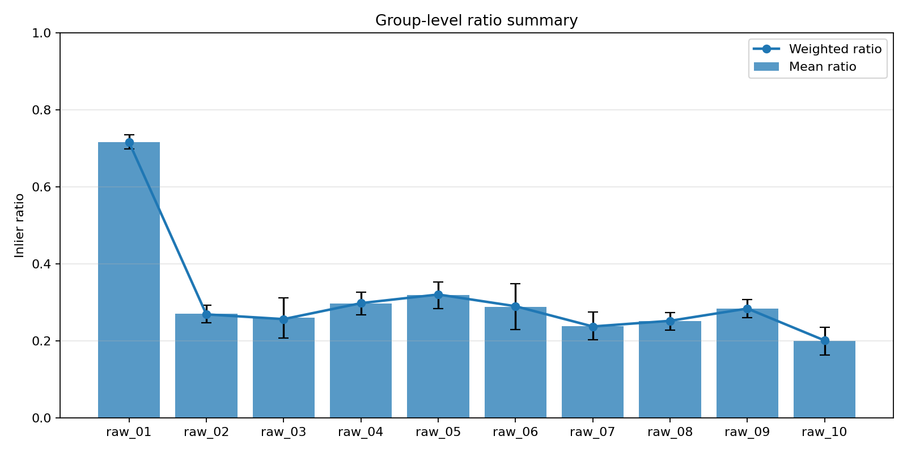
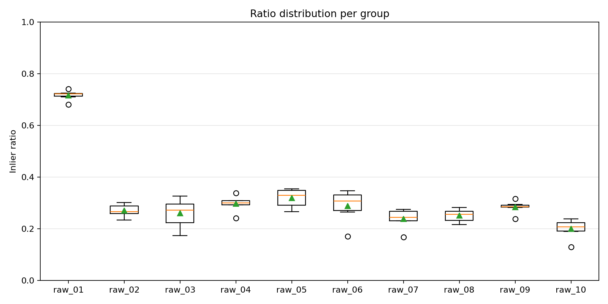
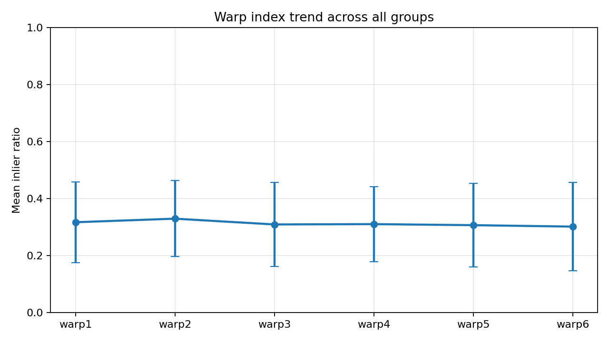

# Lab1 报告：多视角螺丝图像俯视矫正（Homography）
**徐启翔 523030910063**

## 1. 方法概述

本作业的目标是将 60 张存在视角变化的图像恢复到与模板图像一致的俯视视角。整体流程如下：

1. 读取模板图与待矫正图像。
2. 进行颜色掩膜预处理，保留更有利于匹配的彩色区域。
3. 在掩膜区域内提取关键点与描述子。
4. 对描述子执行 KNN 匹配并用 ratio test 过滤错误匹配。
5. 基于匹配点对使用 RANSAC 估计单应矩阵 $H$。
6. 用 $H$ 将待矫正图像透视变换到模板坐标系，输出恢复结果。
7. 统计每张图像的匹配总数、内点数及内点比例。

### 1.1 关键点检测与描述

代码支持三种特征方法：SIFT、AKAZE、ORB。默认模式为 `auto`，会依次尝试三种方法并选择 RANSAC 内点数最多的结果作为该图像最终输出。

这种设计的考虑是：不同图像在模糊程度、透视畸变、局部遮挡上差异较大，单一检测器在全部样本上并不稳定，自动选择可以提升整体鲁棒性。

### 1.2 匹配与去外点

匹配阶段采用 BFMatcher 的 KNN（$k=2$），并使用 Lowe ratio test 进行筛选：

$$
d_1 < 0.75\,d_2
$$

其中 $d_1$ 和 $d_2$ 分别是最近邻与次近邻距离。该策略可明显减少歧义匹配点。

在此基础上，使用 RANSAC 估计单应矩阵：

$$
\mathbf{x}' \sim H\mathbf{x}
$$

并通过内点集合进一步剔除外点，最终得到稳定的几何变换。

### 1.3 图像矫正

估计到 $H$ 后，使用 `cv2.warpPerspective` 将输入图像映射到模板尺寸 $(w, h)$，从而得到俯视矫正结果。输出图像文件名与输入严格一致，便于批处理和提交检查。

## 2. 关键改进与参数设置

### 2.1 颜色掩膜约束匹配区域

为减少背景纹理和螺丝局部干扰，先在 HSV 空间中做阈值分割，再进行膨胀操作：

- HSV 阈值下界：$(0,120,50)$
- HSV 阈值上界：$(180,255,255)$
- 形态学核：$21\times21$ 椭圆核

该步骤的作用是扩大有效区域并提高可匹配关键点密度，降低无关区域参与匹配带来的误匹配。

### 2.2 多检测器自动选择

当参数设置为 `--method auto` 时，程序顺序尝试 SIFT、AKAZE、ORB 三种方法，每种方法都独立完成“检测-匹配-RANSAC”，并以“RANSAC 内点数”作为评分，选择最优结果输出。该策略相比固定单方法通常能获得更高成功率。

### 2.3 匹配策略参数

- 匹配器：BFMatcher
- 距离度量：
  - SIFT 使用 L2
  - AKAZE/ORB 使用 Hamming
- KNN 参数：$k=2$
- ratio test 阈值：$0.75$

### 2.4 RANSAC 参数

- 重投影误差阈值：`--ransac-thresh`，默认 `5.0`

该参数控制内点判定宽松程度：过小会导致有效匹配被误剔除，可能估计失败；
过大则可能引入噪声点，影响几何精度。因此本实现默认 5.0，在多数样本上可获得较稳定的估计结果。

### 2.5 调试与可复现性设计

程序支持 `--debug` 开关，会额外保存模板掩膜与输入图掩膜，与各检测器的内点匹配可视化结果。

同时，会导出 `stats.csv` 记录每张图像的 detector、inliers、total、ratio，便于后续进行结果分析与失败样本定位。

## 3. 结果展示与简要分析

本节统计由 `stats.csv` 计算得到，按照每 6 张图像为一组（即每个 `raw_0X` 为一组）进行比较。分析指标与脚本保持一致：

- 组均值 `mean_ratio`：反映该组整体配准质量；
- 组标准差 `std_ratio`：反映该组 6 张图内部稳定性；
- 加权比例 `weighted_ratio=sum(inliers)/sum(total)`：考虑匹配规模后的组质量指标。

### 3.1 结果展示
1. 组均值结果：

2. 组标准差结果：

3. 加权比例结果：

### 3.2 结果解读

1. 组间差异明显，`raw_01` 显著优于其余各组。
   `raw_01` 的均值达到 0.7168，远高于其余组（大多在 0.20-0.32 区间），说明该组图像在特征可见性、透视难度或干扰程度上更有利于稳定匹配。

2. 中等表现组集中在 `raw_04~raw_06`、`raw_09`。
   这些组的均值大致在 0.28-0.32，表明算法在大多数场景下可以获得可用配准，但仍存在一定误匹配与几何误差。

3. 相对困难组为 `raw_07`、`raw_08`、`raw_10`。
   其中 `raw_10` 均值最低（0.1995），可视为当前流程下的主要薄弱场景，建议后续优先针对该组做参数或策略优化。

4. 稳定性方面，`raw_06` 与 `raw_03` 波动较大。
   两组的 `std_ratio` 分别为 0.0596 与 0.0523，明显高于多数分组，说明同一组内不同 `warp` 难度差异较大，或者部分图像对当前掩膜/匹配策略较敏感。

### 3.3 图像展示
以下图像分别展示了上述优秀组，中等组与困难组的矫正结果示例：

| 优秀组 | 模板图像 |
| --- | --- |
|  |  |
| 中等组 | 困难组 |
|  |  |

可以发现，随着处理效果的下降，反映在矫正结果上扭曲程度增加，图像留空增加。

## 4. 小结

本方法通过“颜色掩膜 + 局部特征匹配 + RANSAC 去外点 + 自动检测器选择”实现了批量视角矫正流程。实现上重点保证了对不同图像条件的适应性（auto 多检测器）和对外点和干扰的鲁棒性（ratio test + RANSAC）。
