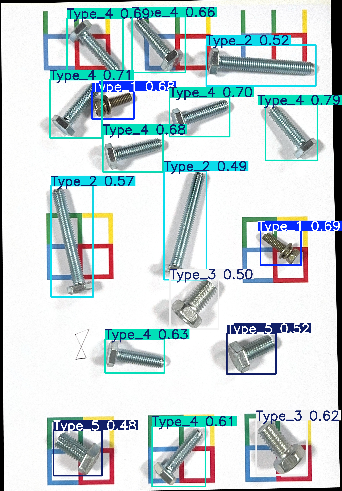
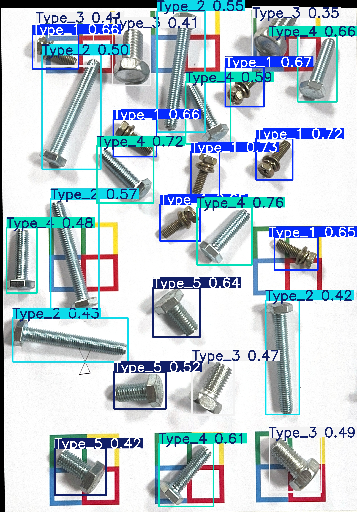

# Lab2 报告：基于 YOLOv8 的螺丝自动计数
**徐启翔 523030910063**

## 1. 算法设计与流程

本次作业的目标是自动检测并统计图像中 5 种不同类型螺丝的数量。考虑到螺丝尺度变化、种类相似以及工业场景下的复杂性，我选择了基于深度学习的目标检测方法来实现这一任务。整体技术流程如下：

1.  **数据准备与增强**：
    - 利用第一次作业中生成的俯视视角矫正图像作为基础训练数据。
    - 对原始数据集进行几何变换（旋转90、180、270度）进行数据增强，以扩充数据集规模并提升模型的旋转不变性。`augment_data.py` 脚本负责此流程。

2.  **模型选择**：
    - 选用 `YOLOv8n` 作为基础模型。该模型在速度和精度之间取得了良好平衡，适合本次作业对实时性和准确性的双重需求。

3.  **训练策略：3-Fold 交叉验证**：
    - 为了充分利用有限的数据并得到泛化能力更强的模型，我采用了 3-Fold 交叉验证的训练策略，如 `train_kfold.py` 所示。
    - 将数据集随机划分为 3 个子集，每次取其中 2 个子集作为训练集，剩余 1 个作为验证集，共训练出 3 个独立的模型（`model_0.pt`, `model_1.pt`, `model_2.pt`）。

4.  **模型评估与选择**：
    - 在一个包含 14 张图像的自建测试集上，对 3 个模型分别进行评估。根据作业评分规则（误差为0得1分，误差为1得0.5分），计算每个模型的总分。
    - 选择得分最高的模型作为最终提交的模型。

5.  **推理与输出**：
    - 使用最终选定的模型对测试集图像进行推理，统计每张图中 5 类螺丝的数量。
    - 按照作业要求，将结果保存为 `result.npy` 字典，并记录总处理时间到 `time.txt`。

## 2. 实验与调优细节

### 2.1 数据标注

本实验的训练数据来源于第一次作业中矫正后的俯视图像。为了构建有效的目标检测训练集，我使用了 **Label Studio** 工具对这些图像进行了人工标注，仔细框选出所有螺丝并分配了对应 5 种类别的标签，最后将其导出为 YOLO 格式供模型使用。

### 2.2 数据增强

为了让模型学习到不同角度下的螺丝特征，我首先通过 `augment_data.py` 脚本对数据集进行了扩充。该脚本对每张原始图像及其对应的 YOLO 格式标签执行了 90、180、270 度的旋转，并将数据量扩充至原来的 4 倍。这一步骤对于提升模型在面对任意角度放置的螺丝时的鲁棒性至关重要。

### 2.3 模型训练与 K-Fold 交叉验证

训练流程由 `train_kfold.py` 实现，核心步骤如下：

- **K-Fold 划分**：使用 `sklearn.model_selection.KFold` 将数据集随机切分为 3 折（`n_splits=3`, `shuffle=True`）。这确保了每个数据点都有机会成为验证集的一部分，从而使模型评估更可靠。
- **独立训练**：对每一折数据，都独立执行一次 YOLOv8 的训练流程。训练的核心超参数设置如下：
    - **模型**：`yolov8n.pt` (预训练权重)
    - **Epochs**: 150
    - **图像尺寸 (imgsz)**: 1024
    - **Batch Size**: 4
    - **设备**: MPS (适用于 Apple Silicon)
    - **数据增强 (Albumentations)**:
        - 旋转 (degrees): 90.0
        - 垂直/水平翻转 (flipud/fliplr): 0.5
        - HSV 色彩空间增强: hsv_h=0.015, hsv_s=0.7, hsv_v=0.4

通过这种方式，我们得到了三个模型：`model_0.pt`, `model_1.pt`, `model_2.pt`，分别对应三折交叉验证的产物。

### 2.4 模型选择

为了从三个模型中选出最优模型，我在一个自建的测试集（共14张图，70个测试点）上进行了评估。评分标准为：每个计数点完全正确得1分，误差为1得0.5分，误差大于等于2得0分。三个模型的得分如下：

| 模型 | 得分 (满分70) |
|---|---|
| `model_0.pt` | 25 / 70 |
| `model_1.pt` | 50.5 / 70 |
| `model_2.pt` | **62 / 70** |

从结果可以看出，`model_2.pt` 的表现远优于其他两个模型，因此我最终选择 `model_2.pt` 作为提交的模型。

## 3. 结果分析与局限性

### 3.1 模型差异分析

在交叉验证过程中，三个模型表现出巨大差异，尤其是 `model_0` 的得分显著低于另外两个。分析这背后的主要原因，可以归结为以下两点：

1.  **数据量太少**：本次实验的可用基础数据集规模非常有限。在极小的数据量下进行 K-Fold 切分，会极大放大“运气成分”。`model_0` 的训练集划分可能恰好抽到了一批缺少某种特定场景或特征的数据，使模型未能充分学习到泛化的目标特征。这在小样本任务中极容易导致测试分数出现断崖式的波动。
2.  **预测种类太少**：本任务仅有 5 个需要预测的分类。由于种类极少且总体数据稀少，一旦某几次切分导致某一两个种类在验证集或训练集中的比例甚至存在性产生失衡，模型就会迅速发生特征混淆和性能下降。这也会使整体模型评分结果对极少量的错检或漏检极其敏感，从而反映为分数的巨大落差。

综合来看，数据量与预测种类的双重稀缺放大了模型在交叉验证中的波动，而 `model_2` 的数据划分恰好获得了最均衡的特征分布，因此表现最佳。

### 3.2 算法局限性

尽管最终模型取得了不错的分数，但该算法仍存在一些潜在的局限性：

- **对新光照条件的敏感性**：虽然训练时使用了 HSV 增强，但如果测试图像的光照条件与训练集差异过大（如出现强烈的反光或阴影），检测性能可能会下降。
- **小目标与密集场景的挑战**：对于尺寸特别小或堆叠紧密的螺丝，模型可能会发生漏检或将多个目标识别为一个，影响计数准确性。
- **泛化到全新背景**：当前模型主要在较为单一的背景下训练，如果将模型用于背景纹理非常复杂的场景，可能会产生误报。

后续的优化可以从更丰富的数据增强策略（如模拟更多光照变化）、使用更高分辨率的输入或针对性地处理小目标检测问题等方面入手。

## 4. 预测结果展示

以下是模型在部分测试图像上的预测结果示例。可以看出模型能够有效地对不同类型的螺丝进行定位和分类：

| 预测示例 1 | 预测示例 2 |
| :---: | :---: |
|  |  |

## 5. 小结

本方法采用 `YOLOv8n` 模型，结合几何数据增强和 3-Fold 交叉验证策略，成功实现了对多种螺丝的自动检测与计数。通过对交叉验证产生的多个模型进行评估和筛选，最终选择表现最优的模型，在自建测试集上取得了 62/70 的分数。实验结果证明了该方案的可行性与有效性，同时也揭示了小数据量场景下数据划分对模型性能的显著影响。