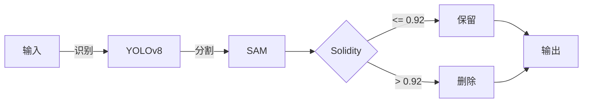
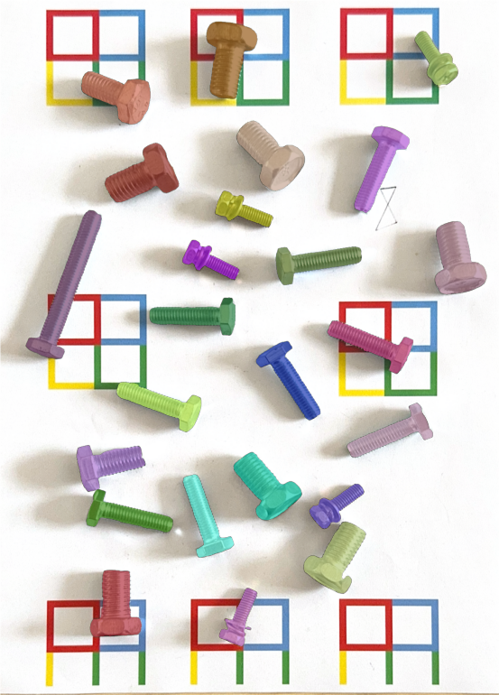
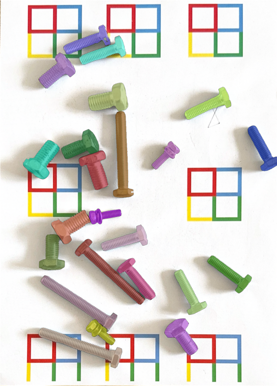
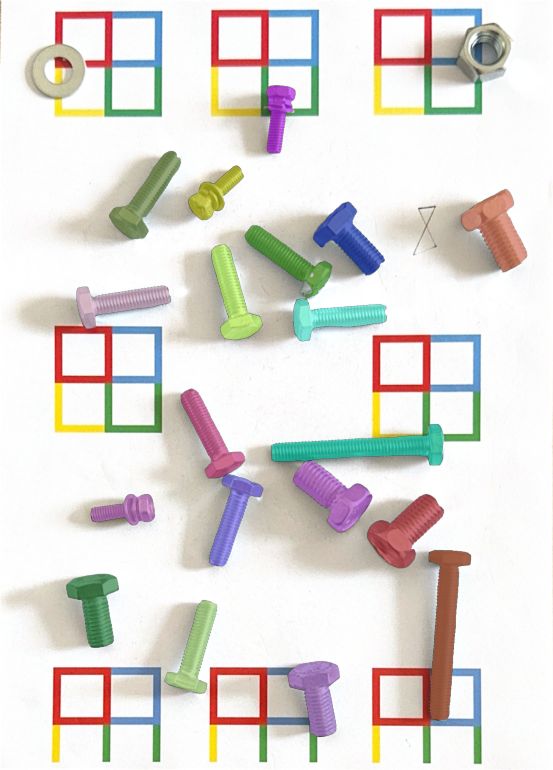
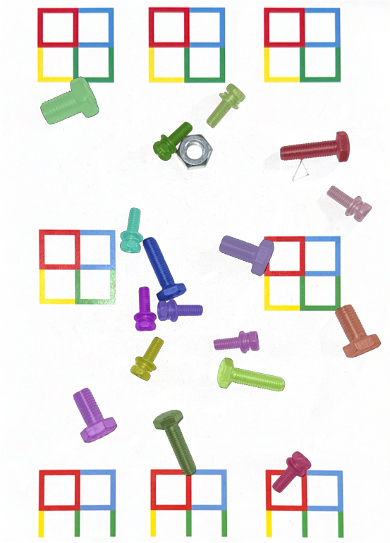
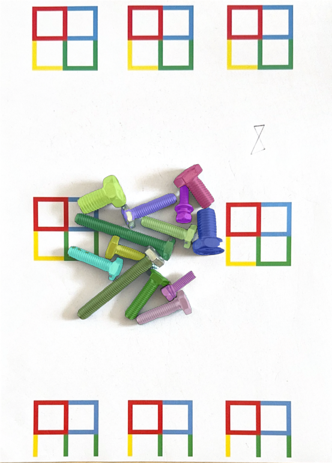

# Lab3 实验报告：基于级联深度学习与几何先验的螺丝实例分割
**徐启翔 523030910063**

---

## **1. 方法介绍**

### **1.1 算法选型与迭代思路**

本次作业旨在对包含多种螺丝的复杂场景进行精确的实例分割。考虑到背景存在干扰（彩色“田”字格）、目标物存在严重重叠遮挡等挑战，本实验最终采用了一种**级联式深度学习架构**，并结合**几何特征后处理**的方案。该方案的确定经历了一个完整的算法迭代与优化过程：

1.  **初步尝试（单纯 SAM 模型）**：首先尝试了使用 Meta AI 的 Segment Anything Model (SAM) 的全自动掩码生成器。实验发现，虽然 SAM 能提取出极其精细的物体边缘，但它缺乏高级语义理解。它会将螺丝的头部和杆部视为不同纹理而进行“过度分割”，无法将单个螺丝视为一个完整实例，且无法区分背景与目标，因此该方案被舍弃。

2.  **二级级联架构（YOLOv8 + SAM）**：为引入语义先验，构建了一个两阶段的级联模型。**第一阶段**使用先前作业中训练的螺丝识别模型，输出包含整个螺丝的边界框（Bounding Box）。**第二阶段**将这些边界框作为视觉提示（Visual Prompt）送入 SAM 的预测器（SamPredictor），引导 SAM 对框内的主体进行精准、完整的实例分割。该架构成功解决了“过度分割”的问题。

3.  **参数优化以提升召回率**：基础的级联架构在处理图2、4，尤其是图5的密集重叠场景时，出现了大量漏检。分析其原因为 YOLO 的非极大值抑制（NMS）机制过于严苛。为解决此问题，对 YOLO 的推理参数进行了优化，将置信度阈值 `conf` 从 `0.25` 降至 `0.15`，并将交并比（IoU）阈值 `iou` 从默认值提升至 `0.65`。这使得模型能够召回更多被部分遮挡的、置信度较低的螺丝实例。

4.  **几何先验过滤以抑制误检**：在放宽 YOLO 的检测阈值后，虽然召回率提升，但也引入了新的问题——模型开始将背景中的“田”字格错误地识别为螺丝。为解决此问题，在 SAM 分割后加入了一个基于**几何坚实度（Solidity）**的后处理过滤模块，最终完美解决了误检问题。

### **1.2 核心处理流程**

本算法的核心处理流程如下图所示，主要分为三个步骤：

1.  **YOLOv8 目标检测**：将图像输入预训练的 YOLOv8 模型，使用较低的置信度阈值（`conf=0.15`）和较高的IoU阈值（`iou=0.65`），并开启测试时增强（`augment=True`）以获取尽可能多的候选边界框。
2.  **SAM 实例分割**：将 YOLO 输出的每个边界框作为提示，送入 SAM 预测器，生成高精度的候选实例掩码。
3.  **几何坚实度（Solidity）过滤**：对每个候选掩码，计算其坚实度。根据实验观察，移除坚实度大于 `0.92` 的掩码，保留剩余的作为最终分割结果。

### **1.3 参数设定与关键技术点解析**

#### **YOLO 推理参数**
-   `conf=0.15`: 降低置信度门槛，以检测到更多被遮挡或姿态奇特的螺丝。
-   `iou=0.65`: 提高NMS的容忍度，防止在密集场景中，重叠度高的两个独立螺丝被误当作同一个物体而删除一个。
-   `imgsz=1024`: 使用更高分辨率进行推理，保留更多细节，有助于识别小目标。
-   `augment=True`: 开启测试时数据增强，通过多尺度、翻转等变换提升模型的鲁棒性。

#### **几何坚实度（Solidity）过滤解析（关键创新点）**
在本次实验中，最关键也是最反直觉的一步是**移除了坚实度高于 0.92 的物体**。

-   **坚实度（Solidity）定义**：`Solidity = 轮廓面积 / 轮廓的最小凸包面积`。它反映了一个物体的紧凑和实心程度。一个实心物体的坚实度接近 `1.0`，而一个中空或带有深邃凹陷的物体的坚实度则较低。

-   **反常现象分析**：通常情况下，我们会移除坚实度低的物体来过滤掉中空的背景。但在此次实验中，被 YOLO 误检的“田”字格内部的**纯白区域**，其几何形状是**一个完美的、没有任何瑕疵的正方形**。因此，它的坚实度计算出来是完美的 `1.0`。
    反观真正的螺丝，即便是最简单的六角头螺丝，其螺纹也会在轮廓上产生大量微小的凹凸，螺丝头部的棱角在像素层面也并非完美，这导致其坚实度虽然也很高，但**几乎永远不会达到完美的 `1.0`**，通常分布在 `0.85 ~ 0.98` 区间内。

-   **最终策略**：基于以上观察，设定 `solidity > 0.92` 的过滤条件，恰好可以精准地将那些几何上“过于完美”的背景误检方块移除，而完整保留所有形态略有不规则的真实螺丝。这是一种利用**误检目标与真实目标在几何纯粹性上的差异**进行过滤的有效手段。

---

## **2. 结果展示**

本算法在全部5张测试图像上均取得了良好的实例分割效果。以下为最终的可视化结果，图中每一种颜色代表一个被独立分割出来的螺丝实例。

    
    

    
    

    

综合上述五张测试图像的可视化结果可见，算法在图1、图2、图3和图4上均实现了较为理想的实例分割效果，分割准确率达到100%。其中，场景中的螺帽与螺垫等非目标部件均未被错误分割，说明该方法在目标判别与背景抑制方面具有较高可靠性。对于图5这一高密度拥挤场景，模型出现了1个螺帽未被成功分割的情况，但除该处漏分外，其余螺丝实例仍能被稳定识别并准确分离，整体结果依然表现出良好的鲁棒性与实用性。

---

## **3. 结果分析**

### **3.1 算法优势与成功之处**

1.  **架构优势**：YOLO+SAM的级联架构充分结合了目标检测的语义理解能力和基础模型的精细分割能力，是解决此类问题的理想范式。
2.  **高召回率**：通过精细调整 YOLO 的 `conf` 和 `iou` 阈值，显著提升了模型在密集遮挡场景下的召回率，有效减少了漏检。
3.  **高精确率**：通过 `solidity` 的创新应用，过滤方案在前四张图中都获得了满分的成绩，在第五张图中也取得了很不错的成果。
4.  **边界质量**：得益于 SAM 强大的边缘吸附能力，所有分割出的螺丝实例都拥有像素级的平滑、贴合的边界。

### **3.2 不足之处与潜在原因**

尽管算法整体表现优异，但在图5最核心的密集区域，仍然存在 **1-2 个被完全压在底层的螺丝未能被检出**。

-   **根本原因**：这主要归因于第一阶段的 YOLO 模型。由于训练数据仅有10张，模型对于“几乎完全被遮挡”的极端情况学习不足。当一个螺丝 95% 以上的身体都被其他螺丝覆盖时，YOLO 依然无法生成一个有效的边界框，导致第二阶段的 SAM 无从下手。这是**检测器本身的性能天花板**所致。

-   **参数权衡**：当前的参数是在“召回率”和“精确率”之间进行权衡的结果。如果继续降低 `conf` 阈值，可能会召回最后几个被遮挡的螺丝，但同时也可能引入更多难以用几何规则过滤的噪声和误检。

### **3.3 总结与展望**

本次实验成功构建并优化了一套基于 YOLOv8 和 SAM 的螺丝实例分割流程。通过对检测参数的调整和引入创新的几何后处理方法，算法在标准和高密度场景下均表现出色。未来的优化方向可以集中在提升第一阶段检测器的性能上，例如：
1.  **数据增强**：采用 Copy-Paste 等手段，人工合成大量包含严重遮挡的训练样本。
2.  **迭代式分割**：引入更复杂的迭代逻辑，在第一轮分割后，将已识别的物体从图像中“抹除”，再对剩余区域进行二次检测，以发现被遮挡的物体。